You are a senior product manager. Using the CONTEXT below, produce a comprehensive, implementation-ready PRD for the **AI Recycle-to-Market Generator (ESG Edition)**.

## Output Requirements
Write a single PRD document with these sections (use headings & numbered/bulleted lists):

1) Overview & Goals  
2) Personas & Primary Use Cases  
3) Success Metrics (leading & lagging; with target values)  
4) User Stories (INVEST format)  
5) Scope (In / Out)  
6) System Architecture (high-level diagram + component responsibilities)  
7) End-to-End Workflow (numbered steps mapping to components)  
8) Decision Governor: Ask-vs-Search-vs-Derive (policy + VOI gate math)  
9) Functional Requirements (F1..F-N) with Acceptance Criteria (Given-When-Then)  
10) Non-Functional Requirements (latency SLOs, availability, security, privacy, accessibility, i18n, cost)  
11) Data Model & State (schemas for Requirements, Slot Ledger/Evidence, ESG Report, Images, Sessions)  
12) External Integrations (search/LCA, safety rules, image gen/edit, 3D export)  
13) API & Events (backend endpoints, request/response JSON, WebSocket/SSE events, error codes)  
14) Frontend UX Spec (screens, components, states, microcopy, error/empty states)  
15) Observability & Analytics (logs, metrics, traces, product events, dashboards)  
16) Testing & Quality (unit/contract/e2e/load/safety evals; acceptance test checklist)  
17) Phasing & Milestones (MVP → v1.1 → v1.2 with exit criteria)  
18) Risks, Assumptions, Open Questions, and Mitigations  
19) Appendices (Mermaid diagrams for flow/state, constants, prompts)

Keep language crisp and action-oriented. Where helpful, include tables. Use realistic constants (provided below). Reference specific models, nodes, and endpoints exactly as named in CONTEXT. Do **not** invent new features beyond scope unless labeled as “Future”.

---

## CONTEXT (authoritative)

### Product
**AI Recycle-to-Market Generator (ESG Edition)** — turns waste materials into viable products/campaigns. Users input materials + a goal (e.g., “Coke can + plastic bag → fashion accessory”). The system outputs 3 concept visuals (2D), tools/materials/BOM, ESG report card, a step-by-step DIY guide, optional edits (“Magic Pencil”), and optional 3D model export.

### Orchestration & Models
- **Orchestrator:** LangGraph with checkpointer and `thread_id` (pause/resume via `interrupt()` + `Command(resume=...)`).  
- **Reasoning/Parsing:** Google Gemini 2.5 (`-flash` for speed, `-pro` for deeper eval) using **responseSchema** for strict JSON.  
- **Image Generation/Edit:** **Imagen** (Generate and Edit).  
- **Persistence:** Redis (OG images + ephemeral state); optional DB for sessions.  
- **Search/Tools:** Deterministic Python tools and/or Gemini Function Calling for:  
  `search_web`, `lookup_material_affordances`, `esg_proxy`, `safety_rules`.

### Workflow (mirrors our Mermaid)
1. **User Input (U)** → natural language request.
2. **P1 Progressive Ingredient Discovery** (3-phase extraction):
   - **P1a Ingredient Extraction:** Create temp JSON file `{ "ingredients": [{"name": null, "size": null, "material": null}] }` and use Gemini responseSchema to identify materials from user input
   - **P1b Null Checker:** Scan JSON for null values, generate targeted questions for missing ingredient data, trigger `interrupt()` for user clarification
   - **P1c Ingredient Categorizer:** Group ingredients by type (containers, fasteners, decorative, tools), add null entries for missing essential categories, loop back to P1b if new nulls added
   - **Output:** Complete ingredient JSON + derived fields → `artifact_type`, `size`, `quantities{material:int}`, `tools_available[]`, `budget_bucket`, `esg_priority`
3. **G1 Goal Formulation:** desired artifact, constraints (budget/tools), ESG targets.  
4. **O1 Choice Proposer:** feasible build options using M1 (knowledge graph: materials→affordances, tooling, safety/feasibility, ESG datasets) + P2 (context retrieval: prior builds, brand tone).  
5. **E1 Evaluator:** feasibility score, aesthetic fit, ESG score (LCA proxy), safety check.  
6. **Decision Governor (Ask-vs-Search-vs-Derive):**  
   - **Subjective/preference** (style, `budget_bucket`, `esg_priority`) → default **ASK**.  
   - **Objective/public fact** (can dimensions, common tools) → default **SEARCH**.  
   - **Derived/computable** (size from artifact type; default BOM from recipe) → default **DERIVE**.  
   - **Safety-critical** → **SEARCH**, and **ASK** if low confidence.  
   - **VOI gate:** ask only if `(1 − confidence) × impact > VOI_THRESHOLD`.  
   - Maintain **Slot Ledger (Evidence)** per field:  
     `{ value, source: "ask|search|derive|assume", confidence: 0..1, needs_confirmation: bool, evidence_refs: [] }`.
7. If any slot missing or flagged → **Clarify** node emits one numbered prompt & pauses (`interrupt`).  
8. **PR1 Prompt Builder ×3:** compose 3 distinct prompts (style/material/constraint knobs).  
9. **NB Imagen ×3:** generate 3 concept previews.  
10. **A1 Previews:** show images + BOM/Tools/ESG.  
11. **D1 Selection:** user picks one; optional skip to finalize.  
12. **R1 Store OG & State in Redis.**  
13. **MP Magic Pencil (Imagen Edit):** localized edit prompt; **D2** accept/edit again loop.  
14. **H1 Package Outputs:** final 2D image, ESG report card, DIY steps, BOM/tools list.  
15. **TP 3D Model Generation (3rd-party):** return **OUT** (STL/GLB link, printable guide, shareable mockups).  
16. **Fallback:** if no viable options, loop O1/E1 with constraints relaxed (explain to user).

### Progressive Ingredient Discovery Details

**P1a: Ingredient Extraction Node**
- **Input:** User natural language (`"Coke can + plastic bag → bracelet"`)
- **Process:** Gemini Flash with responseSchema extracts identifiable materials
- **Output:** Partial JSON with identified ingredients, nulls for missing data
- **Example:** `{"ingredients": [{"name": "soda_can", "size": null, "material": "aluminum"}, {"name": "plastic_bag", "size": null, "material": "plastic"}]}`

**P1b: Null Checker & Question Generator**
- **Input:** Current ingredient JSON state
- **Process:** Scan for null values, generate targeted questions (one at a time)
- **Question Examples:**
  - Size missing: `"What size is your soda can? (12oz standard, 16oz, 20oz, or other?)"`
  - Category gap: `"Do you have any fasteners? (tape, glue, wire, string, clips?)"`
- **Output:** `interrupt()` with specific question or continue signal

**P1c: Ingredient Categorizer**
- **Input:** Complete ingredient data from user responses
- **Process:** Group by categories (containers, fasteners, decorative, tools), detect missing essential categories
- **Category Rules:**
  - **Containers:** Primary materials (cans, bottles, boxes)
  - **Fasteners:** Joining materials (tape, glue, wire, screws)
  - **Decorative:** Aesthetic elements (paint, stickers, fabric)
  - **Tools:** Available instruments (scissors, drill, heat gun)
- **Output:** Add null entries for missing categories, trigger loop back to P1b

**Temp File Management**
- **Location:** Redis with `thread_id` as key: `ingredients:{thread_id}`
- **Lifecycle:** Create on P1a → Update during P1b → Finalize in P1c → Delete after G1
- **Schema:** `{ "ingredients": [{"name": str|null, "size": str|null, "material": str|null}], "categories": {"containers": [], "fasteners": [], "decorative": [], "tools": []} }`

### Decision Governor Details
- **Slot policies** (defaults):
  - `size`: derived from ingredient data; impact 0.5
  - `quantities`: derived from ingredient JSON; impact 0.8
  - `tools_available`: extracted from ingredient categories; impact 0.6
  - `budget_bucket`: subjective; impact 0.7
  - `esg_priority`: subjective; impact 0.6
- **VOI**: ask only when model uncertainty would materially affect downstream choices.
  `VOI_THRESHOLD = 0.25` (initial).
- **Evidence Ledger** is user-visible (chips) and auditable (logs).
- **Ingredient Integration:** References temp ingredient JSON for completeness checking

### Frontend (Next.js/React)
- **Chat Pane** (streaming).  
- **Slot Ledger Panel**: chips per slot (colors by source), “Accept/Change” inline.  
- **Preview Grid**: 3 cards with image, prompt, BOM.  
- **Magic Pencil Drawer**: OG image + localized edit text → Imagen Edit; “Apply/Undo/Compare”.  
- **ESG Card**: recycled %, carbon proxy, safety checklist (badges).  
- **Reply Microcopy**: concise numbered prompts (e.g., “1) size — earring | bracelet | tote | custom (inferred: bracelet) … Reply like: `1: bracelet, 2: 1 can + 1 bag, 3: scissors, 4: <$10, 5: least_new`”).

### Backend APIs (to document precisely in PRD)
- `POST /graph/stream?thread_id` → SSE stream of messages/events (including `interrupt`).
- `POST /graph/resume` → resume with `{ thread_id, text }`.
- `GET /ingredients/{thread_id}` → retrieve current ingredient JSON state.
- `POST /ingredients/{thread_id}/update` → `{ ingredient_index: int, field: str, value: str }` → updated ingredient JSON.
- `POST /ingredients/{thread_id}/add` → `{ name: str, size: str, material: str }` → ingredient JSON with new entry.
- `DELETE /ingredients/{thread_id}` → cleanup temp ingredient file.
- `POST /images/generate` → { prompts[] } → { image_ids[], bytes? }.
- `POST /images/edit` → { image_id|bytes, mask?, edit_text } → { image_id }.
- `POST /3d/export` → { prompt|image_id } → { stl_url, glb_url }.
- **Events:** `message`, `interrupt`, `ingredient_question`, `ingredient_updated`, `ingredient_complete`, `preview_ready`, `edit_ready`, `package_ready`, `error`.

### Data Schemas (minimum)
- **Ingredient JSON** (temp file):
  `{ ingredients: [{ name: str|null, size: str|null, material: str|null }], categories: { containers: [str], fasteners: [str], decorative: [str], tools: [str] }, completed: bool, last_question: str|null }`
- **Requirements** (derived from ingredient JSON):
  `{ artifact_type: str, size: str, quantities: {material:str→int}, tools_available: [str], budget_bucket: enum("<$10","$10–$30","$30+"), esg_priority: enum("recycle_pct","low_carbon","least_new") }`
- **SlotLedger** (per key):
  `{ value, source: "ask|search|derive|assume", confidence: float, needs_confirmation: bool, evidence_refs: [str], ingredient_ref: str|null }`
- **ESG Report**:
  `{ recycled_pct: float, carbon_proxy: "low|med|high", safety_notes: [str], substitutions: [ {from, to, rationale} ] }`
- **Session**: `{ thread_id, created_at, last_event_at, status, ingredient_file_id: str|null }`
- **Image**: `{ id, bytes|url, prompt, created_at, parent_id? }`

### Non-Functional Targets (initial)
- **Latency:** P50 generate-3 previews ≤ 15s; P95 ≤ 25s. Edit turn P50 ≤ 6s.  
- **Availability:** 99.5% monthly.  
- **Data Retention:** images/state 7 days (configurable); redact PII; no biometric processing.  
- **Security:** TLS everywhere; signed URLs for assets; role-based access for team features.  
- **Accessibility:** WCAG 2.1 AA; keyboard nav; alt text for images.  
- **Cost Guardrails:** image count default=3, max=4; automatic backoff/retry.

### Testing & Safety
- **Safety-critical gating:** no instructions until safety check passes; block flagged adhesives/tools; provide alternatives.  
- **ESG proxy validation:** snapshot tests against known material sets; warn on low confidence.

### Constants / Defaults
- `VOI_THRESHOLD = 0.25`  
- Default `esg_priority` if unset: `least_new` (flag `needs_confirmation=true`).  
- Image previews = 3; edit TTL = 7 days.

### Diagrams (include as Mermaid in Appendix)
- Flowchart: (use the provided Mermaid from our chat).  
- Optional sequence diagram: Client ↔ Backend ↔ LangGraph ↔ Models/Tools.

---

## Formatting & Style
- Be specific; tie each requirement to a component & API.  
- Provide clear **acceptance criteria** per FR (Given-When-Then).  
- Provide example requests/responses for APIs.  
- Include measurement plans for Success Metrics.  
- Keep scope realistic for MVP → v1.1 → v1.2.  
- Use the exact field names and node names from CONTEXT.

```mermaid
---
config:
  theme: redux
---
flowchart TD
    U@{ label: "User Input<br>(e.g., 'Coke can + plastic bag → fashion accessory')" } --> P1a["P1a: Ingredient Extraction<br>(Create temp JSON + Gemini responseSchema<br>identify materials from input)"]
    P1a --> P1b["P1b: Null Checker<br>(Scan JSON for nulls<br>generate targeted questions)"]
    P1b --> P1bcheck{{"Nulls found?"}}
    P1bcheck -- Yes --> P1bask["Ask User<br>(interrupt with targeted question)"]
    P1bask --> P1bupdate["Update Ingredient JSON<br>(with user response)"]
    P1bupdate --> P1b
    P1bcheck -- No --> P1c["P1c: Ingredient Categorizer<br>(Group by type: containers, fasteners<br>decorative, tools)"]
    P1c --> P1check{{"Any new nulls<br>from json?"}}
    P1check -- Yes --> P1b
    P1check -- No --> P1["P1: Complete Requirements<br>(artifact_type, size, quantities<br>tools_available, budget, esg_priority)"]
    G1{{"Goal Formulation<br>• Desired artifact (type/style)<br>• Constraints (budget, tools)<br>• ESG targets (recycle %, impact)"}} --> O1["Choice Proposer<br>(generate feasible build options<br>based on requirements + ingredients)"] & E1["Evaluator (Goal Check + Utility)<br>• Feasibility score<br>• Aesthetic fit<br>• ESG score (LCA proxy)<br>• Safety check"]
    O1 --> E1
    P1 --> G1
    E1 -- rank & filter --> PR1["Prompt Builder ×3<br>(style, materials, constraints<br>→ 3 distinct prompts)"]
    PR1 --> NB["Nano Banana (Image Gen) ×3<br>(2D concept previews)"]
    NB --> A1["Show Previews +<br>Tools/Materials Breakdown<br>"]
    A1 --> D1{"User selects one concept?"}
    D1 -- Yes, proceed --> R1[("Store OG Image & State in Redis")]
    R1 --> MP["Magic Pencil Edit\n(localized edit prompt)"]
    MP --> NB2["Nano Banana (Edited Image)"]
    NB2 --> A1 & D2{"Accept edited\nimage?"}
    D1 -- Skip edit --> H1["Package Outputs<br>• Final 2D image<br>• ESG report card<br>• DIY step-by-step<br>• BOM &amp; tools list<br>•DIY Steps"]
    D2 -- Accept --> H1
    D2 -- Edit again --> MP
    H1 --> TP["3D Model Generation (3rd-party)<br><br>"]
    TP --> OUT["Deliverables<br>• STL/GLB link<br>• Printable guide<br>• Shareable campaign mockups"]
    E1 -- "fall-back" --> F1{{"No viable options?<br>(Goal not satisfiable)"}}
    F1 --> O1
    M1["World State / Knowledge Graph<br>• Materials→Affordances<br>• Tooling capabilities<br>• Safety/feasibility<br>• ESG datasets"]
    P2["Context Retrieval<br>(prior successful builds, patterns, brand tone)"]
    U@{ shape: lean-r}
     U:::sensor
     U:::sensor
     P1a:::sensor
     P1a:::sensor
     P1b:::sensor
     P1b:::sensor
     P1bcheck:::decision
     P1bcheck:::decision
     P1bask:::action
     P1bask:::action
     P1bupdate:::action
     P1bupdate:::action
     P1c:::sensor
     P1c:::sensor
     P1check:::decision
     P1check:::decision
     P1:::sensor
     P1:::sensor
     G1:::goal
     G1:::goal
     O1:::plan
     O1:::plan
     E1:::plan
     E1:::plan
     PR1:::plan
     PR1:::plan
     NB:::external
     NB:::external
     A1:::action
     A1:::action
     D1:::decision
     D1:::decision
     R1:::external
     R1:::external
     MP:::external
     MP:::external
     NB2:::external
     NB2:::external
     D2:::decision
     D2:::decision
     H1:::action
     H1:::action
     TP:::external
     TP:::external
     OUT:::action
     OUT:::action
     F1:::decision
     F1:::decision
     M1:::model
     M1:::model
     P2:::sensor
     P2:::sensor
    classDef sensor fill:#CFE8FF,stroke:#1B75D1,color:#000
    classDef model fill:#E8DAFF,stroke:#6B2FB9,color:#000
    classDef goal fill:#FFE6C5,stroke:#C47000,color:#000
    classDef plan fill:#CFF5F2,stroke:#0B7267,color:#000
    classDef action fill:#D7F8D0,stroke:#2B8A3E,color:#000
    classDef external fill:#EEE,stroke:#666,color:#000
    classDef decision fill:#fff,stroke:#444,stroke-dasharray: 5 5
```

